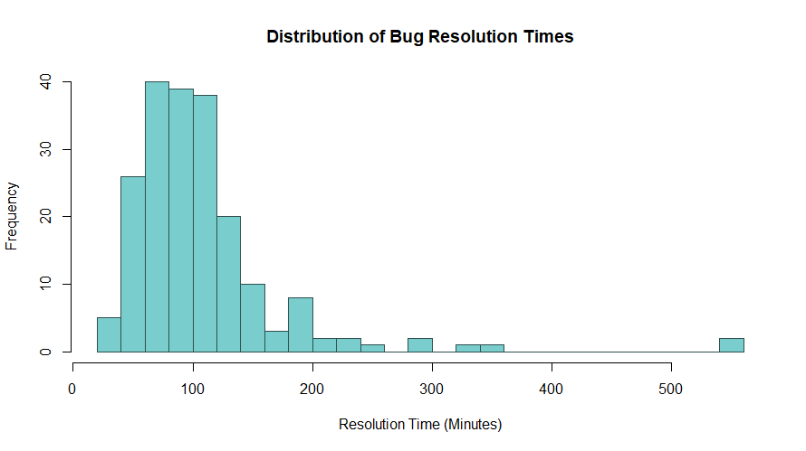
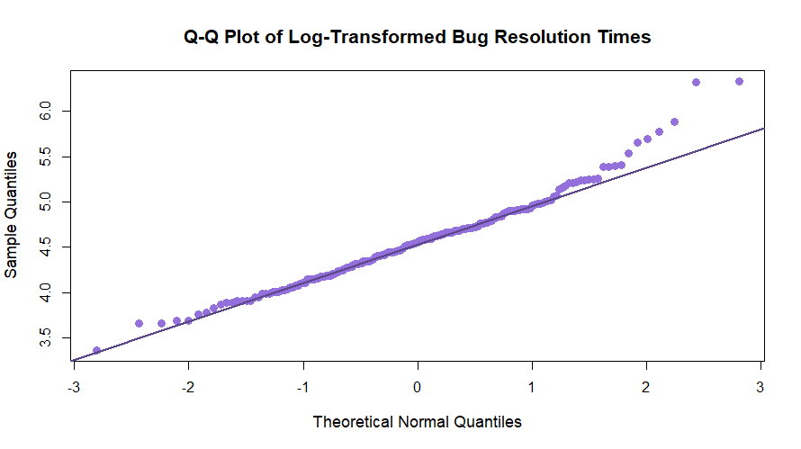
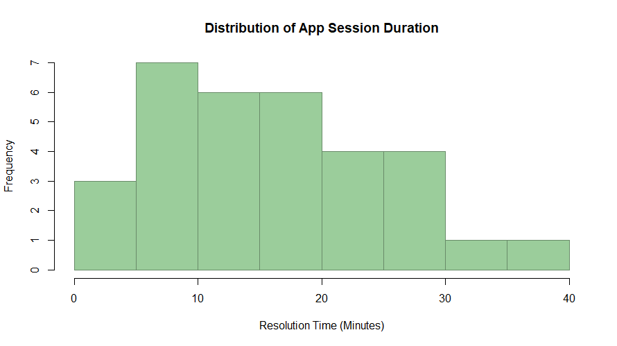
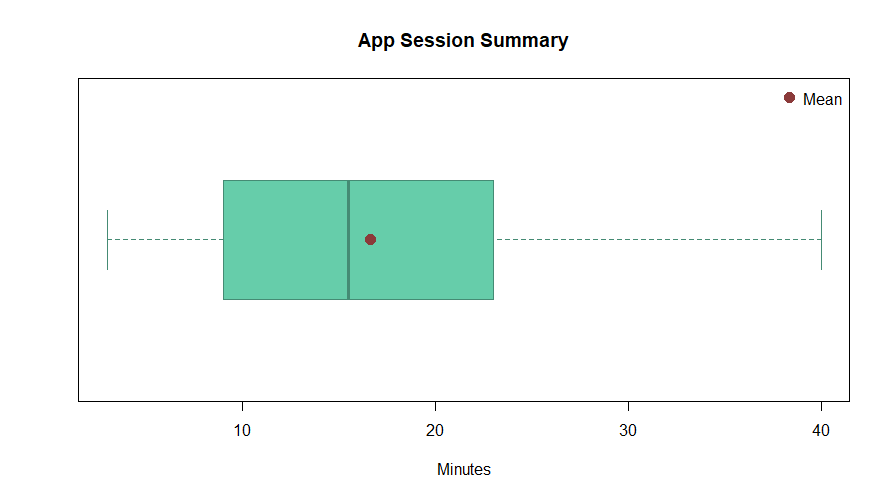
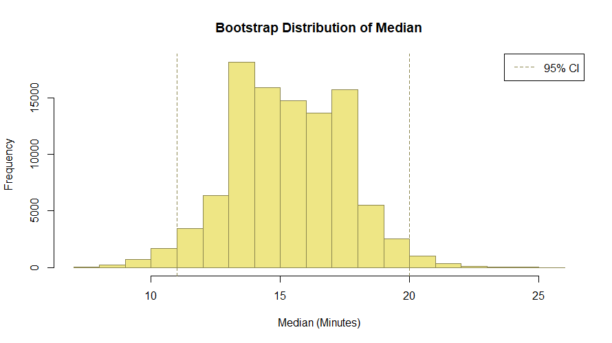

# 📊 Session Duration & Resolution Time Analysis

A statistical deep-dive into two real-world style datasets:
- 🐞 Bug resolution times  
- 📱 App session durations  

This project combines distribution modelling, bootstrap methods, and hypothesis testing to extract meaningful insights from skewed data.

---

## 📁 Datasets

### 🐞 Bug Resolution Time
- Size: 200 observations  
- Unit: Minutes  
- Characteristics: Strong right-skew with extreme values (e.g. 560 minutes)

### 📱 App Session Duration
- Size: 32 observations  
- Unit: Minutes  
- Characteristics: Moderately right-skewed, smaller sample size

---

## 🔍 What This Project Does

- Visualises distributions (histograms + boxplots)
- Applies lognormal modelling to skewed data
- Uses bootstrap resampling (B = 100,000) for inference
- Constructs confidence intervals for:
  - Median
  - Interquartile Range (IQR)
- Performs a parametric bootstrap hypothesis test
- Compares non-parametric vs asymptotic methods

---

## 📊 Visual Analysis

### 🐞 Bug Resolution Time Distribution

**Explanation:**  
This histogram shows a strong right-skew, with most bugs resolved relatively quickly but a long tail of extreme cases. These large values heavily influence the mean.

---

### 🐞 Log-Transformed Q-Q Plot

**Explanation:**  
After log transformation, the data aligns closely with the straight line, supporting the assumption of approximate normality. This justifies using a lognormal model.

---

### 📱 App Session Duration Distribution

**Explanation:**  
Session durations are moderately right-skewed. Most users spend between 5–20 minutes, with fewer longer sessions extending toward 40 minutes.

---

### 📱 Boxplot with Mean Highlighted

**Explanation:**  
The mean lies above the median, confirming positive skewness. The longer upper whisker indicates higher variability in longer sessions.

---

### 🔁 Bootstrap Distribution of Median

**Explanation:**  
The bootstrap distribution is slightly irregular and not perfectly normal. This reflects:
- Small sample size (n = 32)
- Discrete nature of the median
- Underlying skewness in the data  

This justifies using bootstrap methods instead of relying purely on normal approximations.

---

## 📈 Key Results

### 📌 Median (App Sessions)
- Point estimate: **15.5 minutes**
- Bootstrap 95% CI: **[11, 20]**
- Asymptotic CI: **[12.37, 19.40]**

Bootstrap is wider (captures skewness), while the asymptotic interval is narrower due to model assumptions.

---

### 📌 Interquartile Range (IQR)
- Estimate: **13.5 minutes**
- Bootstrap 95% CI: **[8.25, 18.25]**

The IQR shows greater uncertainty than the median, indicating that spread is harder to estimate.

---

### 📌 Hypothesis Test (Median > 15?)
- p-value ≈ **0.41**
- Result: Fail to reject H₀

There is no strong statistical evidence that the median session duration exceeds 15 minutes.

---

## 🧠 Key Takeaways

- Real-world duration data is rarely normally distributed
- Log transformation + lognormal modelling is effective for skewed data
- Bootstrap methods:
  - Require fewer assumptions  
  - Better capture uncertainty  
- Asymptotic methods:
  - More efficient  
  - Depend on model validity  

---

## ⚙️ Tech Used

- R  
- Base R (bootstrapping, plotting, inference)  
- survival (used where required)

---

## 📌 Notes

- All results are reproducible via script  
- No external dependencies beyond required libraries  
- Focused on practical statistical analysis rather than theoretical demonstration  
